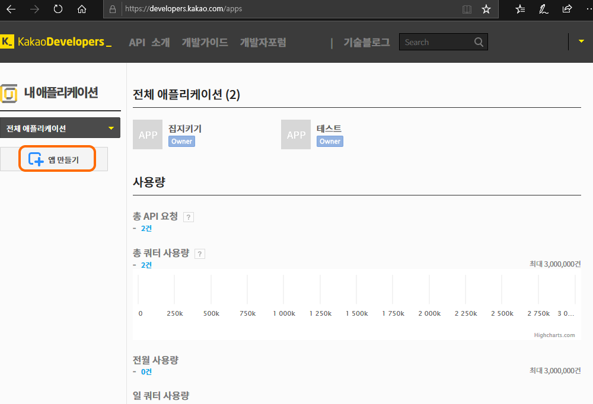
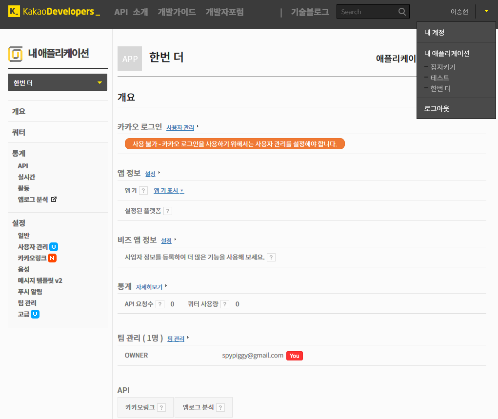
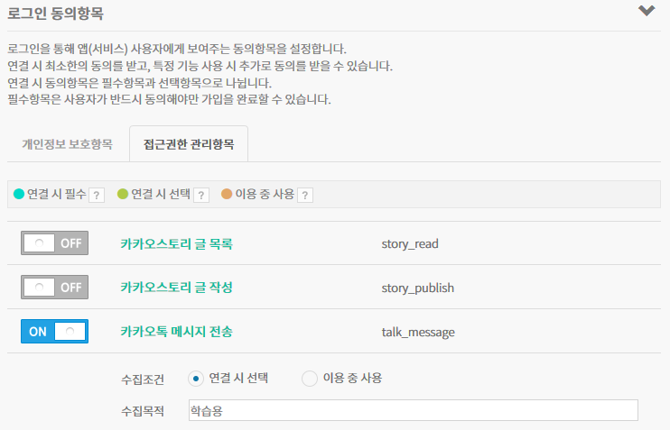
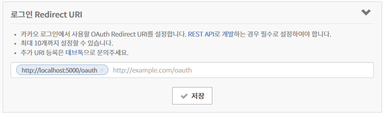
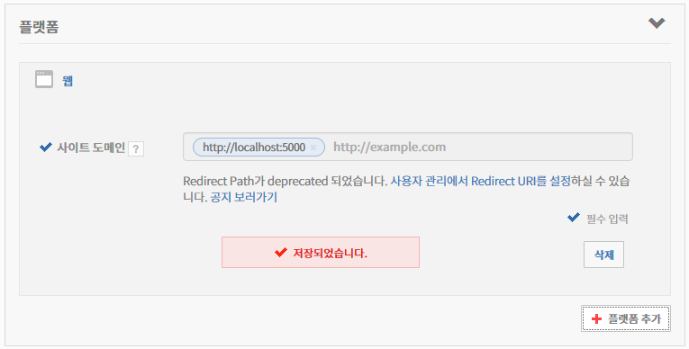
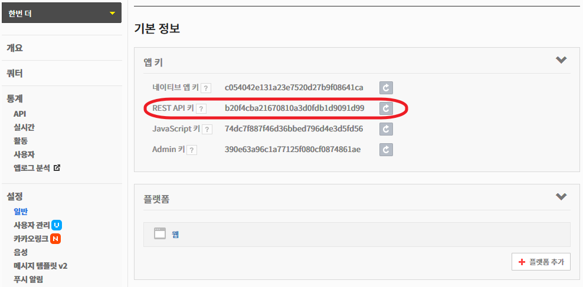
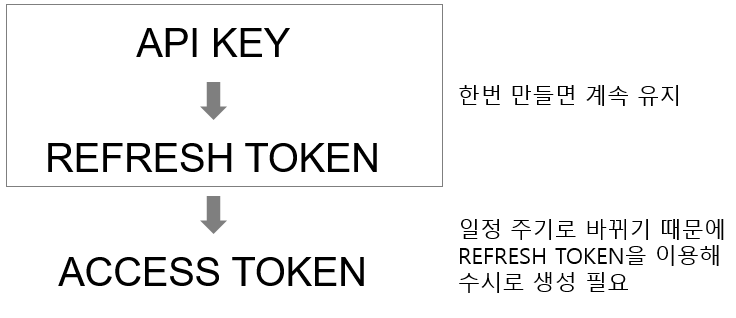
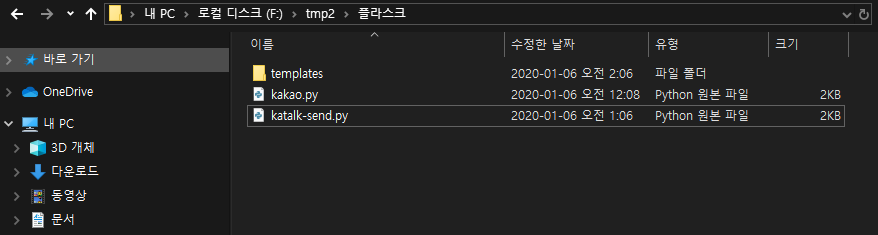
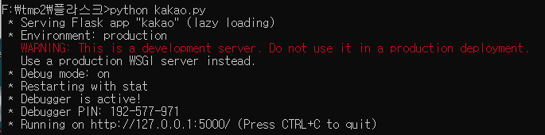

# 나의 카카오 톡으로 메시지 보내기

우리나라에서 가장 많이 사용하는 메신저인 카톡을 이용해 자신에게 카톡 메시지를 보내는 방법입니다.
----------------------------------
[주넥님의 블로그](http://blog.daum.net/_blog/BlogTypeView.do?blogid=0drsH&articleno=79)에서 많은 부분을 참조했습니다. 업데이트 된 카톡 API 반영 및 파이썬 3에서 작동하도록 일부 코드를 수정했습니다.

## 카톡 개발자 계정 및 앱 생성
만약 카카오 개발자 계정이 없다면 https://developers.kakao.com 사이트에서 개발자 계정을 생성합니다. 로그인 후 내어플리케이션에서 앱 만들기를 선택합니다. 저는 이미 2개를 만들어두었습니다. 간단하게 어플리케이션 이름과 회사명을 입력하면 됩니다. <br />
<br /><br />

앱을 만들고 나면 다음과 같은 키들이 자동으로 만들어집니다. 이 값들은 나중에 조회가 가능하기 때문에 따로 저장할 필요는 없습니다.
우측 상단 로그인 계정을 누르면 내 어플리케이션을 조회할 수 있습니다. 여기에서 방금 만든 앱을 선택합니다.
<br /><br />

### 로그인 동의항목 설정
사용자 관리를 클릭 후 사용자 관리를 활성화 합니다. 개인정보 보호항목과 접근권한 관리 항목이 활성화됩니다. 개인정보 보호 항목에서 수집목적을 입력 후  접근권한 관리 항목에서 카카오톡 메시지 전송을 활성화합니다. 그리고 저장 버튼을 눌러 변경 내용을 저장합니다.

<br />

### 로그인 Redirect URI  설정
http://localhost:5000/oauth 값을 입력합니다. 이 값에 대해서는 나중에 다시 설명합니다.
<br />

### 플랫폼 추가
"설정 -> 일반 -> 플랫폼"에서 플랫폼 추가를 눌러 웹을 추가합니다. 사이트 도메인은 Redirect URI에서 입력한 http://localhost:5000를 사용합니다.
<br /><br />


## 카톡 메시지 API의 보안 키 구조
앞에서 앱을 정상으로 만들었다면 다음 그림처럼 API 키 값들을 확인할 수 있습니다. 실제 이 값들은 외부로 노출하면 안됩니다. 우리는 이 중에서 REST API 키를 사용할 것입니다.

<br /><br />


카톡 메시지 전송을 위해서는 위 그림의  API 키 값 이외에 2개의  토큰(Token)이 필요합니다.  
<br /><br />
먼저 API KEY를 이용해 REFRESH TOKEN을 구한 후 문자 전송시점마다 ACCESS TOKEN을 만들어 사용할 것입니다.

## REFRESH TOKEN 얻기
REFRESH TOKEN을 얻기 위해 필요한 것이 앞에서 입력한 Redirect URI입니다. 이를 위해 간단한 웹서버가 필요한데 여기에서는 간단하게 파이썬 플라스크를 이용해 웹서버를 구동합니다. Flask는 파이썬 응용 패키지이기 때문에 사용자 컴퓨터에 파이썬 및 파이썬용 패키지 설치 프로그램인 pip을 먼저 설치해야 합니다. 파이썬은 버젼 3을 이용하길 추천합니다. 파이썬 설치에 관한 설명은 사용자 컴퓨터 OS에 따라 달라지기 떄문에 생략합니다. 다음 과정으로 플라스크 웹서버를 만듭니다.

1. "pip install flask" 명령으로 flask 설치합니다.
2. 웹서버를 실행할 적당한 디렉토리를 만듭니다. WIndows 사용자의 경우에는 파일 탐색기에서 만들면 됩니다.  그리고 다음 파일들을 복사해 넣습니다. index.html 파일은 templates 디렉토리에 복사해넣습니다.
<br /><br />

flask는 기본 5000번 포트를 이용해 웹서버를 실행합니다. 

index.html 파일에서 여러분의 REST API KEY값 부분을 실제 여러분의 API 키값으로 수정합니다.
```html
<!DOCTYPE html>
<html>
<head>
<meta charset="utf-8">
<title>index</title>
</head>
<body>
<a href="https://kauth.kakao.com/oauth/authorize?client_id=여러분의 REST API KEY값&redirect_uri=http://localhost:5000/oauth&response_type=code&scope=talk_message">
    Kakao login
</a>
</body>
</head>
</html>
```

그리고 다음은 웹서버 프로그램인 파이썬 파일 kakao.py 파일입니다. oauth 함수에서 여러분의 키 값을 index.html 파일과 마찬가지로 API 키 값으로 수정합니다.

```python
#!/usr/bin/python
#From http://blog.daum.net/_blog/BlogTypeView.do?blogid=0drsH&articleno=79 
from flask import Flask, render_template, redirect, url_for, request
import requests
import json
app = Flask(__name__)

@app.route('/')
def index() :
    return render_template('index.html')

@app.route('/oauth')
def oauth():
    code = str(request.args.get('code'))
    resToken = getAccessToken("여러분의 API 키값",str(code))  #XXXXXXXXX 자리에 RESET API KEY값을 사용
    return 'code=' + str(code) + '<br/>response for token=' + str(resToken)

def getAccessToken(clientId, code) :  # 세션 코드값 code 를 이용해서 ACESS TOKEN과 REFRESH TOKEN을 발급 받음
    url = "https://kauth.kakao.com/oauth/token"
    payload = "grant_type=authorization_code"
    payload += "&client_id=" + clientId
    payload += "&redirect_url=http%3A%2F%2Flocalhost%3A5000%2Foauth&code=" + code
    headers = {
        'Content-Type' : "application/x-www-form-urlencoded",
        'Cache-Control' : "no-cache",
    }
    reponse = requests.request("POST",url,data=payload, headers=headers)
    access_token = json.loads(((reponse.text).encode('utf-8')))
    return access_token

if __name__ == '__main__' :
    app.run(debug = True)
```
<br />
이제 웹서버를 실행합니다. 다음 그림과 같이 실행된다면 성공입니다. 만약 파이썬 패키 미설치로 인한 에러가 발생한다면 pip 명령으로 에러가 발생한 패키지를 설치 후 다시 실행하면 됩니다.

<br /><br />

브라우저를 이용해서 "localhost:5000" 접속합니다. 그리고 화면의 Kakao login을 눌러 카카오 계정에 로그인합니다. 정상 로그인이 되면 다음 그림처럼 결과값이 나옵니다. 여기에서 ZZZZZZZZZZZZZZZZZZZZZ로 표시한 값이 REFRESH TOKEN입니다. 이 값을 따로 보관해 둡니다.

code=XXXXXXXXXXXXXXXXXXXXXX
response for token={'access_token': 'YYYYYYYYYYYYYYYY', 'token_type': 'bearer', 'refresh_token': 'ZZZZZZZZZZZZZZZZZZZZZ', 'expires_in': 21599, 'scope': 'talk_message profile', 'refresh_token_expires_in': 5183999}

## 문자 보내기
이제 REFRESH TOKEN을 구했기 때문에 문자 보내는 시점에 실시간으로 ACCESS TOKEN을 얻어, 카톡 문자를 보낼 수 있다.

```python
# -*- coding: utf-8 -*-
#!/usr/bin/python
import requests
import urllib
import json

api_key = '여러분의 API KEY'
refresh_token  = "여러분의 REFRESH KEY"
def getAccessToken(refreshToken) :
    url = "https://kauth.kakao.com/oauth/token"
    payload = "grant_type=refresh_token&client_id=%s&refresh_token="%(api_key) + refreshToken
    headers = {
        'Content-Type' : "application/x-www-form-urlencoded",
        'Cache-Control' : "no-cache",
    }
    reponse = requests.request("POST",url,data=payload, headers=headers)
    access_token = json.loads(((reponse.text).encode('utf-8')))
    print(access_token)
    return access_token


def sendText(accessToken, message) :
    url = 'https://kapi.kakao.com/v2/api/talk/memo/default/send'
    payload = '''template_object={
        "object_type" : "text",
        "text" :"%s",
        "link" : {
            "web_url" : "http://yourwebsite.for.pc",
            "mobile_web_url" : "http://yourwebsite.for.mobile"
        },
        "button_title" : "Visit"
        }'''%(message)
    payload = payload.encode('utf-8')
    print (payload)
    headers = {
        'Content-Type' : "application/x-www-form-urlencoded",
        'Cache-Control' : "no-cache",
        'Authorization' : "Bearer " + accessToken,
    }

    reponse = requests.request("POST",url,data=payload, headers=headers)
    access_token = json.loads(((reponse.text).encode('utf-8')))
    return access_token

result =  getAccessToken(refresh_token)   # 메세지 받을 사람의 REFRESH TOKEN 이용
if result['access_token'] is None:
    print ('access token get Error')
else:
    print('access token:' + result['access_token'])
    ret = sendText(result['access_token'], 'Hello World  안녕')
    print (ret)
```
<br />


만약 에러가 발생하지 않는다면 다음과 같은 결과를 얻을 수 있다. 마지막의 {'result_code': 0}는 에러가 발생하지 않았다는 의미이다. 따라서 여러분의 카톡에는 자신이 방금 보낸 문자가 와 있을 것이다. 하지만 알림 메시지는 뜨지 않는다. 카카오 정책이 이렇게 되어 있어서인데 상당히 얄팍한 정책이라는 느낌을 지울 수 없다.

```console
python katalk-send.py
b'template_object={\n        "object_type" : "text",\n        "text" :"Hello World  \xec\x95\x88\xeb\x85\x95",\n        "link" : {\n            "web_url" : "http://yourwebsite.for.pc",\n    
        "mobile_web_url" : "http://yourwebsite.for.mobile"\n        },\n        "button_title" : "Visit"\n        }'
{'result_code': 0}
```